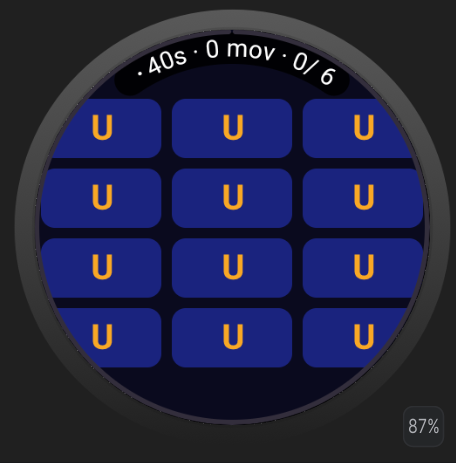
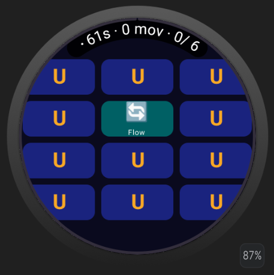
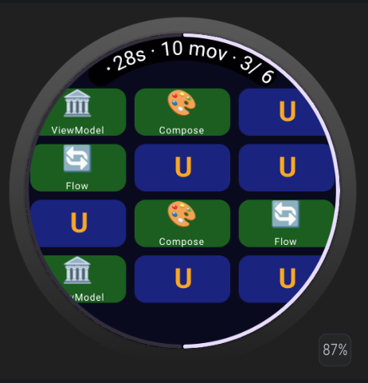
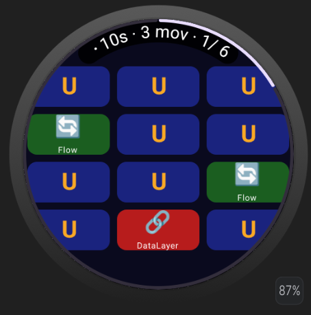
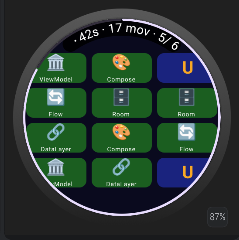

# Memory Match Wear OS


Juego de memoria para **Wear OS** desarrollado con **Jetpack Compose**, animaciones 3D y arquitectura limpia.

El jugador debe encontrar pares de tarjetas relacionadas con conceptos de Android en una cuadrícula circular de 12 cartas.

---

##  Descripción

Memory Match es un juego de memoria donde:

- Hay 12 tarjetas (6 pares)
- El jugador voltea dos tarjetas por turno
- Si coinciden, permanecen visibles, si no coinciden se voltean después de 800ms
- Se gana al encontrar todos los pares

Incluye animaciones, vibración háptica, timer y pantalla de victoria.

---

##  Pares del juego

| # | Emoji | Concepto Android |
|--|--|--|
| 1 | ⚡ | StateFlow |
| 2 | 🏛 | ViewModel |
| 3 | 🗄 | Room |
| 4 | 🔄 | Flow |
| 5 | 🎨 | Compose |
| 6 | 🔗 | DataLayer |

---

##  Arquitectura

Proyecto basado en **Clean Architecture + MVVM**

### Principios aplicados
- Estado inmutable (GameState)
- MVVM con StateFlow
- Casos de uso puros
- Separación UI / lógica
- Efectos con Channel
- Animaciones desacopladas

---

## Stack tecnológico

| Tecnología | Uso |
|---|---|
| Kotlin | Lenguaje principal |
| Jetpack Compose (Wear OS) | UI declarativa |
| StateFlow | Estado reactivo |
| Coroutines | Lógica asíncrona |
| ViewModel | Lógica de presentación |
| DataStore | Persistencia de récord |
| Haptics API | Vibración del reloj |
| JUnit | Tests unitarios |

---

## Mecánica del juego

Estados del juego:

- IDLE → tablero inicial
- SELECTING_FIRST → primera carta
- WAITING_SECOND → segunda carta
- CHECKING → validación
- WON → victoria

Reglas:

- Solo 2 cartas activas a la vez
- No se permite interacción durante validación
- Matching basado en símbolo, no ID
- Delay de 800ms para feedback visual

---

##  UI y animaciones

- Grid 3×4 en pantalla circular
- Animación flip 3D con `animateFloatAsState`
- Efecto `graphicsLayer` (rotación Y)
- Corrección de texto al voltear
- Tamaño optimizado de cartas (34dp)
- Fondo oscuro optimizado para Wear OS

---

##  Interfaz principal

-  TimeText con tiempo y movimientos
-  Indicador de progreso
-  Grid de tarjetas
-  Pantalla de victoria

---

##  Pantalla de victoria

Muestra:

- Tiempo total
- Movimientos realizados
- Mejor récord (DataStore)
- Botón de reinicio

---

## 🧪 Testing

Tests unitarios sin emulador:

- Creación del tablero (12 cartas)
- Validación de pares
- Flip de tarjetas
- Lógica de match/miss

```bash
./gradlew test
````

## Capturas de pantalla 

##  Interfaz principal




##  Interfaz principal con progreso



##  Pantalla de victoria

##  Pantalla con nuevo record de victoria


## Autor
Carmen Catalina Delgado Manzano - demcarmen5@gmail.com

Usuario en GitHub: CatalinaDM

UTNG — Ing. en Desarrollo y Gestión de Software

Noveno Cuatrimestre
